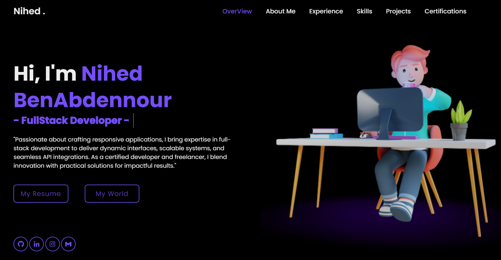

# Nihed BenAbdennour - Personal Portfolio

## Overview

Welcome to my personal portfolio repository! This project is a web-based portfolio to showcase my journey, skills, projects, services, and a way to get in touch. It reflects my passion for software development, problem-solving, and creating innovative solutions in IT.

### Features
- **About Me**: An introduction to my background, journey, and passion for development.
- **Skills and Services**: A showcase of my technical skills, tools, and services offered.
- **Projects**: A visual representation of my top projects with quick access links.
- **Contact Form**: A contact form with email integration, sending notifications to both myself and the user.
- **Responsive Design**: Fully responsive for viewing on desktops, tablets, and mobile devices.

### Live Demo
Check out the live demo here: [nihedbenabdennour.me](#)

## Tech Stack
- **Frontend**: HTML, CSS, JavaScript
- **Icons**: [Boxicons](https://boxicons.com/)
- **UI Library**: [SweetAlert2](https://sweetalert2.github.io/) for notifications

## Setup and Installation

1. Clone the repository:

   git clone https://github.com/yourusername/portfolio.git

Open the folder:

cd portfolio

Open index.html in your browser to view the portfolio locally.

* Email Functionality

The contact form integrates with an external email API to send a notification email to me when someone reaches out, and a confirmation email to the sender.

* API Integration
This portfolio uses Backendflow.io for email notifications. To use this feature:

Update the API key in about.html and set the email and payload as specified in the documentation.
Configure the template and recipient email address to match your own.

## Usage
Contact Form: Users can submit a message directly through the contact form. Email notifications are triggered upon submission to notify me and confirm receipt to the sender.
Alert Notifications: SweetAlert2 is used to give feedback on successful or failed message submissions.
Customization
Feel free to modify the portfolio by:

Updating the About Me section with your personal details.
Adding more skills, projects, or services.
Editing the style.css to change the color scheme or layout.
Screenshots

### License
This project is licensed under the MIT License.

#### Created by Nihed BenAbdennour